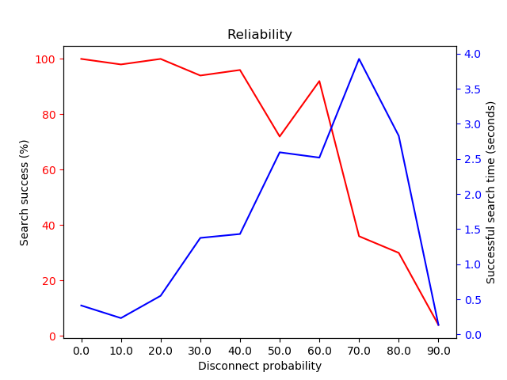
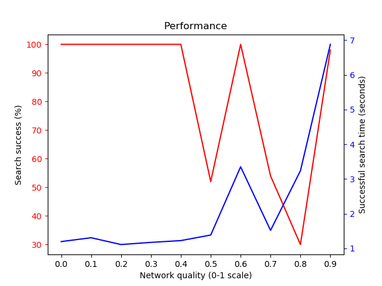
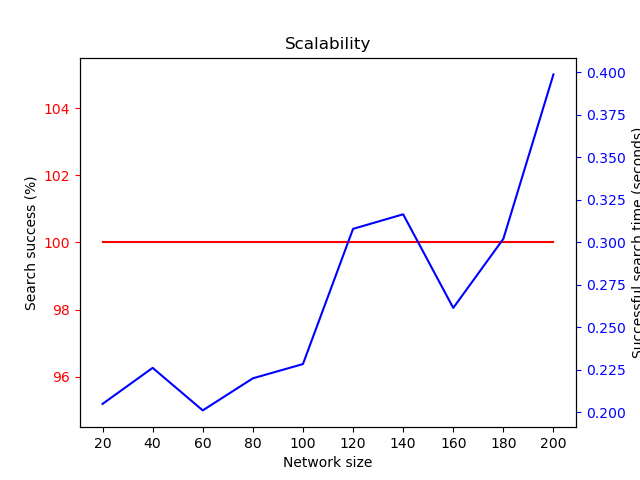

# Benchmarks

Benchmarking is performed on KIPA nodes in Docker containers, in order to track aspects such as
reliability and performance. This document discusses the results of the benchmarks, but also shows
how to run the benchmarks yourself.

## Running benchmarks

Benchmarking exists in the `./simulation` project. In order to run the benchmarks, you can execute:

```bash
python -m simulation \
  --benchmark $BENCHMARK_TYPE \
  --network_config $CONFIGURATION
```

The `$BENCHMARK_TYPE` can be one of the types mentioned in this document: `reliability`,
`performance`, `scalability`, and `resilience`. The `$CONFIGURATION` is YAML file describing the
network (examples are given in `./resources/simulaton_configs`).

Prerequisites from the [README.md](../README.md#simulation) are required to run benchmarks.

## Benchmark types and results

### Reliability

This benchmark evaluates how many searches are successful as increasing amounts of nodes become
unresponsive. After nodes are connected to each other, a percentage of them are removed from the
network, then the searches are performed. The purpose is to show that KIPA does not have any single
point of failure, and is therefore a decentralised system.

#### Results

We find that KIPA maintains a high (90%+) success rate with even 50% of the nodes in the network
missing. This only drops off to ~35% success rate once only 30% of the network is avaialble.



### Performance

This benchmark evaluates the "speed" of the network as bandwidth, latency, and packet loss of the
network deteriorates. "Speed" is determined by the average time to complete a search request. The
purpose is to show that KIPA is fast enough to be used as an IP address resolution system.

#### Results

We find that search times are consistently low, even with poor network speeds. Under extremely poor
conditions, with 15% packet loss, 250ms delay, and 10kbps speed, speeds start to performance worse
with search times of ~7s.



### Scalability

This benchmark evaluates how well KIPA scales to larger networks. We increasingly add more nodes to
the network, and measure the effect on query speed.

#### Results

We find that KIPA scales well, with a 10x increase in nodes (20 to 200) resulting in a 2x increase
in search time (200ms to 400ms). Note that it's not certain how much of the original 200ms is due to
constant overhead. More investigation is needed here.



### Resilience

This benchmark evaluates how robust networks are to "malicious" nodes.  "Malicious", in the context
of this benchmark, means that the node responds to requests with false information (i.e. returning
fake results with non-existent IP addresses and keys). The purpose is to show that KIPA is resilient
against bad actors joining the system.

TODO: This benchmark isn't working after a refactor. Fix this!
